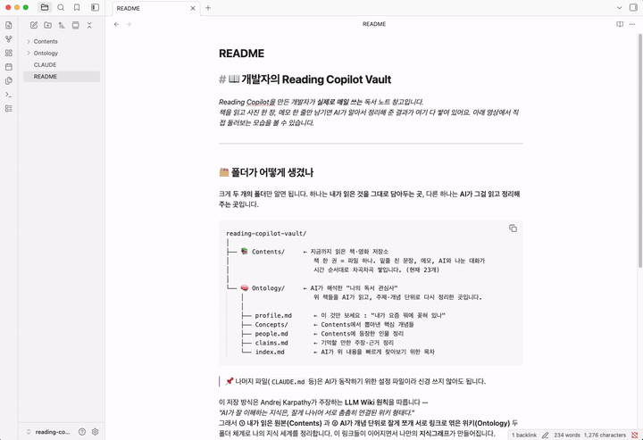
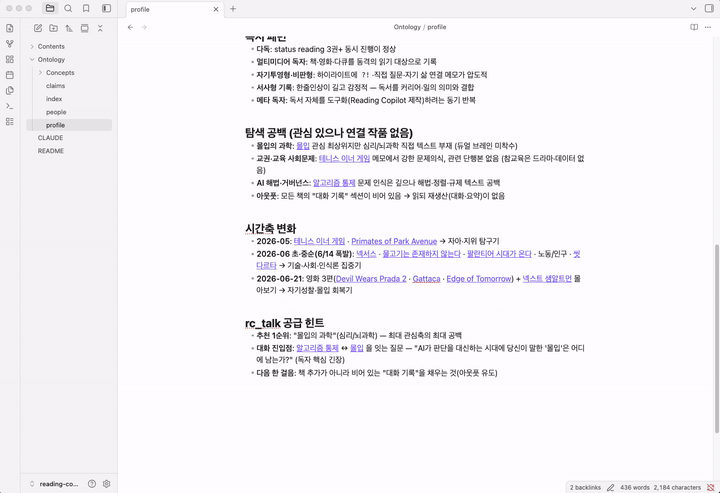

# 📖 개발자의 Reading Copilot Vault

_Reading Copilot을 만든 개발자가 **실제로 매일 쓰는** 독서 노트 창고입니다._
_책을 읽고 사진 한 장, 메모 한 줄만 남기면 AI가 알아서 정리해 준 결과가 여기 다 쌓여 있어요. 아래 영상에서 직접 둘러보는 모습을 볼 수 있습니다._

---

## 🗂️ Vault(폴더) 구조

크게 **두 개의 폴더**만 알면 됩니다. 하나는 **내가 읽은 것을 그대로 담아두는 곳**, 다른 하나는 **AI가 그걸 읽고 정리해 주는 곳**입니다.

```
reading-copilot-vault/
│
├── 📚 Contents/     ← 지금까지 읽은 책·영화 저장소
│                       책 한 권 = 파일 하나. 밑줄 친 문장, 메모, AI와 나눈 대화가
│                       시간 순서대로 차곡차곡 쌓입니다. (현재 23개)
│
└── 🧠 Ontology/     ← AI가 해석한 "나의 독서 관심사"
    │                   위 책들을 AI가 읽고, 주제·개념 단위로 다시 정리한 곳입니다.
    │
    ├── profile.md      ← **[For You]** 이것만 보면 됩니다 — "내가 요즘 뭐에 꽂혀 있는지에 대한 분석"
    ├── Concepts/       ← [For AI] 책에서 뽑아낸 핵심 개념들
    ├── people.md       ← [For AI] 책에 등장한 인물 정리
    ├── claims.md       ← [For AI] 기억할 만한 주장·근거 정리
    └── index.md        ← [For AI] AI가 빠르게 인덱싱하기 위한 목차
```

> 📌 나머지 파일(`CLAUDE.md` 등)은 AI가 동작하기 위한 설정 파일이라 신경 쓰지 않아도 됩니다.

이 저장 방식은 Andrej Karpathy가 말한 **LLM Wiki 원칙**을 따릅니다 —
_"AI가 잘 이해하는 지식은, 잘게 나뉘어 서로 촘촘히 연결된 위키 형태다."_
따라서 Reading Copilot은 **① 내가 읽은 원본(Contents)** 와 **② AI가 개념 단위로 잘게 쪼개 서로 링크로 엮은 위키(Ontology)** 두 폴더 체계로 구성됩니다.
이곳에 차곡차곡 저장된 책을 통해 나의 지식 세계를 담은 **지식그래프**가 만들어집니다.

---

## 🎬 옵시디언에서 직접 둘러보기

### 1) 폴더·파일 둘러보기

옵시디언 볼트 내 `Contents` · `Ontology` 폴더 구조 :
<br />



### 2) 지식그래프 둘러보기

AI가 만든 개념들이 서로 링크로 연결되어 만들어지는 **지식그래프(Graph View)** :
<br />


---

## 🚀 나도 시작하기

이건 완성된 사용 예시입니다. 직접 만들어 보려면 제품 저장소로 가세요 →
**[Reading Copilot 설치·사용법](https://github.com/nohym111-hub/reading-copilot)**
